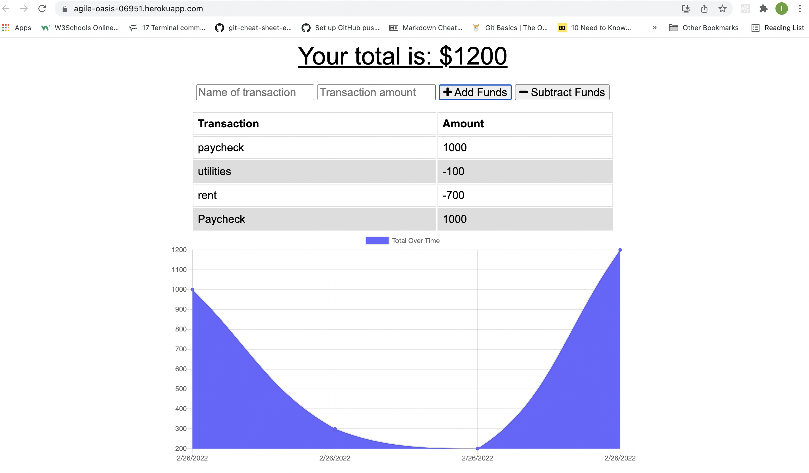

# Budget Tracker 

## Overview
  This project was designed as a homework assignment for my coding bootcamp. The challenge was  to update an existing budget tracker application to allow offline access and functionality.

  IndexDB and Service Worker were used to enable the user to add expenses or deposits to their budget with or without a connection.

  Web Manifest is the blueprint of a PWA used to turn it into a mobile app. It tells the user's device what it is installing and how it should look on the home screen by providing metadata such as the app's title, description and icon.

  

  ## Table of Contents
   - [Deployed Application](#deployed-application)
   - [Contributing](#contributing)
   - [Questions](#questions)

   ## Deployed Application
   [Heroku](https://agile-oasis-06951.herokuapp.com/)

   ## Contributing
   Isaaccna

  ## Questions
   For any questions about the project, please visit my:  
   GitHub Profile: [isaaccna](https://github.com/isaaccna)  
   or  
   Email: @ isaac.andrade1231@gmail.com

